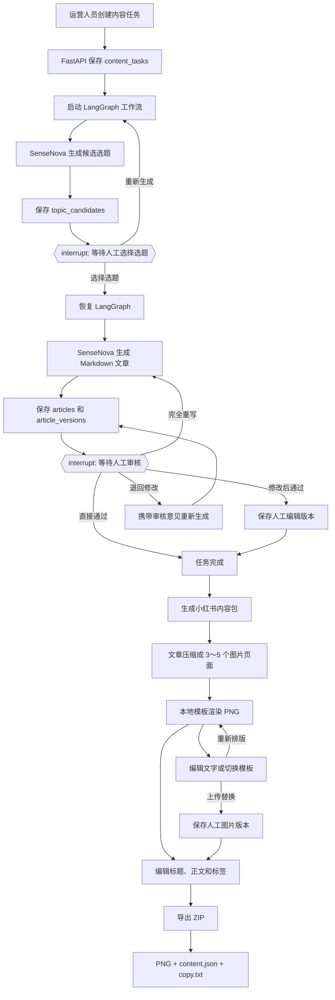
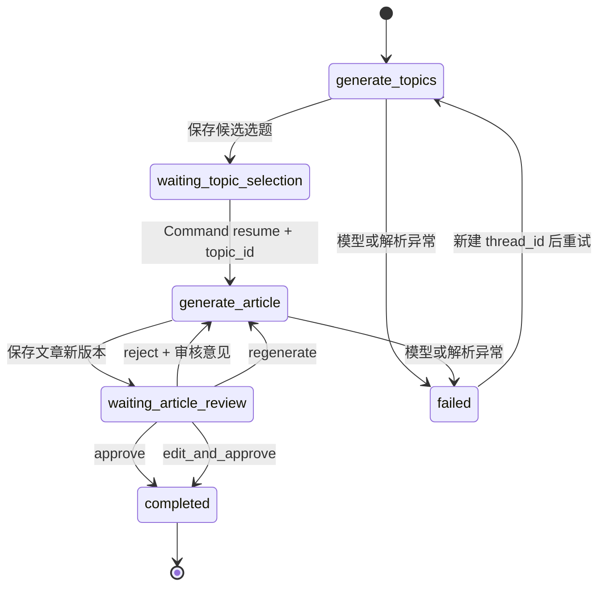
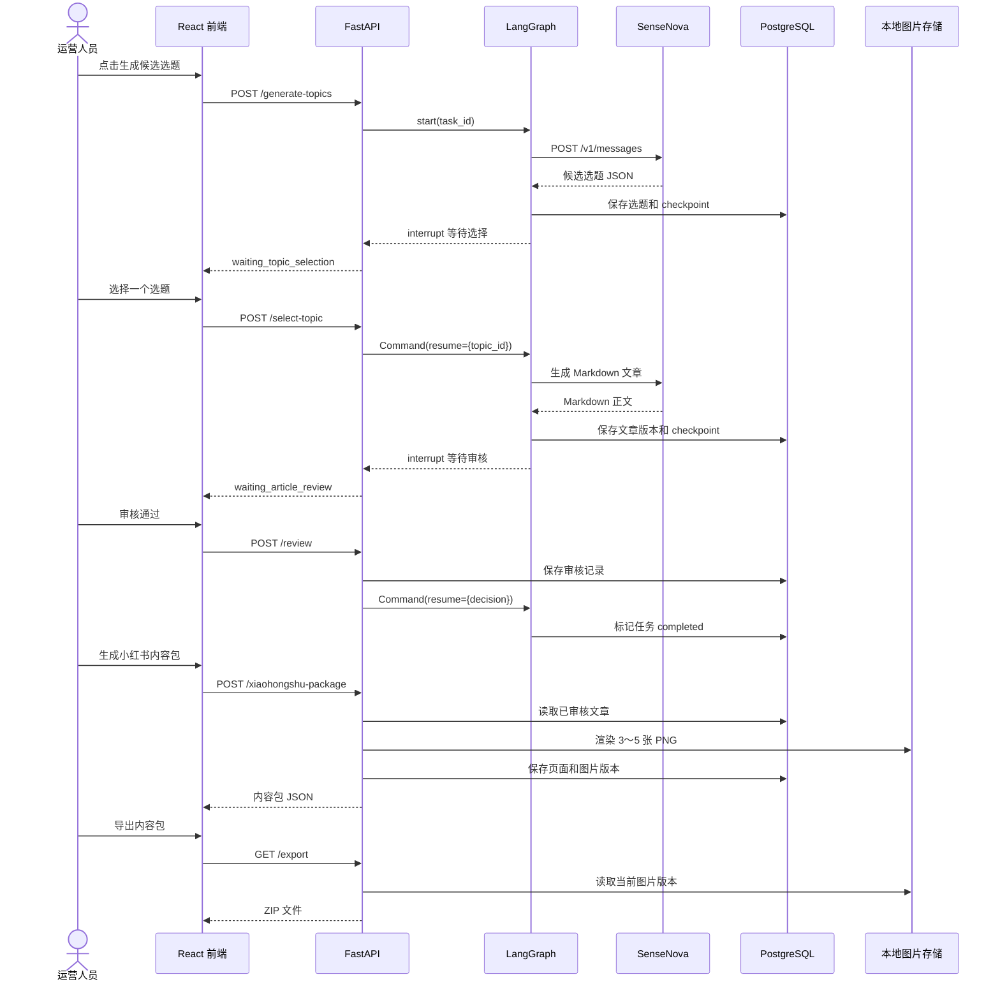
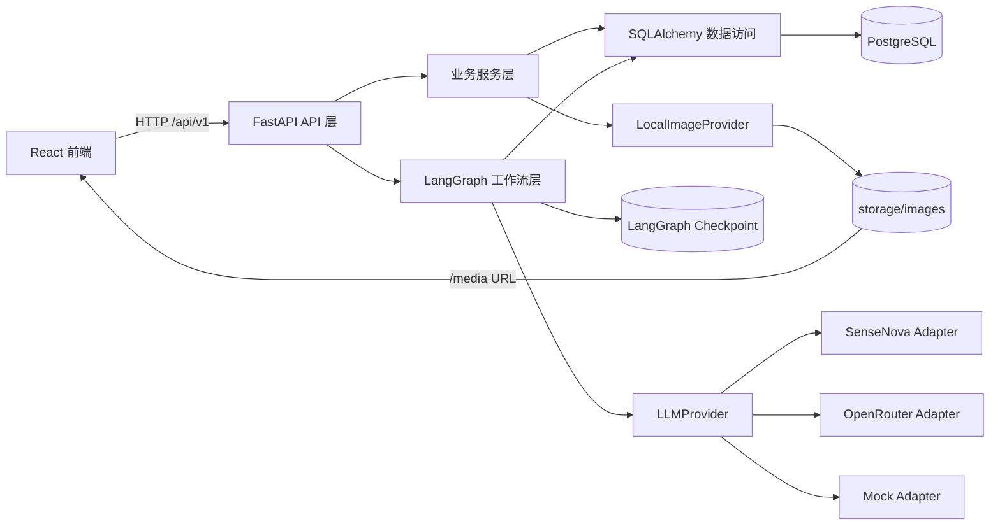
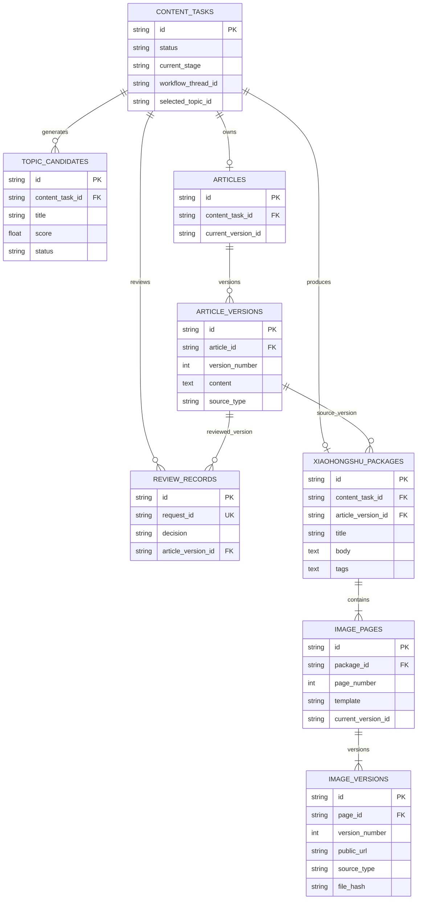
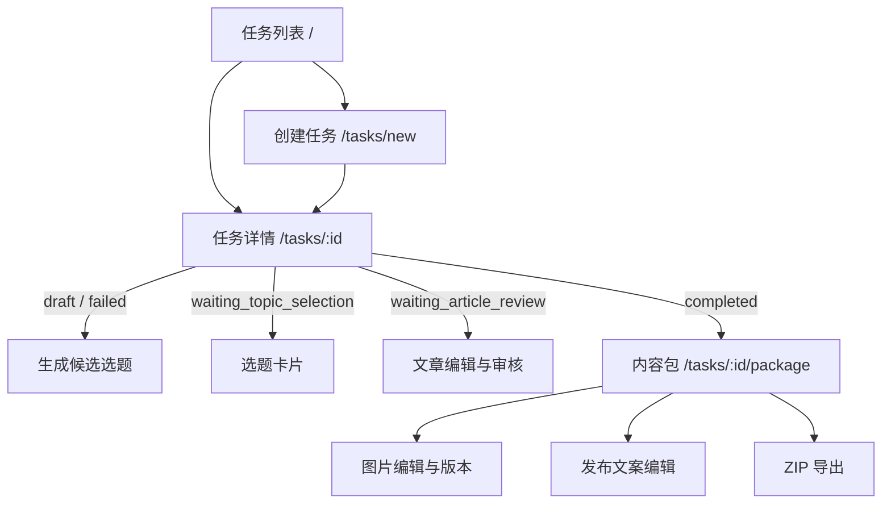

# 当前项目流程图

本文用于理解当前已经实现的第一、二阶段。阅读顺序建议为：业务流程 → LangGraph 流程 → 请求链路 → 数据关系。

## 0. 如何阅读这些图

图中不同形状代表不同类型的动作：

| 图形或文字 | 含义 |
|---|---|
| 普通矩形 | 系统自动执行的步骤 |
| 菱形或 `interrupt` | 系统暂停，必须等待人工操作 |
| 圆柱体 | PostgreSQL 或文件存储 |
| 实线箭头 | 正常执行方向 |
| 标有 `reject`、`regenerate` 的回线 | 审核不通过后的重新生成路径 |
| `failed` | 外部模型、解析或数据库操作发生异常 |

阅读时要区分两类状态：

- **业务状态**：保存在 `content_tasks.status`，前端根据它决定显示哪个页面。
- **图执行状态**：保存在 LangGraph checkpoint，用于暂停、恢复和故障重启。

两者必须同步。例如工作流暂停在选题节点时，业务状态应当是 `waiting_topic_selection`。

## 1. 完整业务流程

这张图回答：“运营人员从创建任务到拿到小红书 ZIP，一共经历哪些步骤？”

其中 AI 只负责生成，选题确认和文案审核始终由人决定。小红书内容包只允许从已经审核通过的文章生成。



### 这一流程的数据输出

| 阶段 | 主要输出 | 保存位置 |
|---|---|---|
| 创建任务 | 主题、要求、目标读者 | `content_tasks` |
| 生成选题 | 4 个左右的候选选题 | `topic_candidates` |
| 生成文章 | Markdown 标题、提纲和正文 | `articles`、`article_versions` |
| 人工审核 | 决策、意见、审核人 | `review_records` |
| 生成内容包 | 标题、正文、标签 | `xiaohongshu_packages` |
| 生成图片 | 页面脚本和当前图片版本 | `image_pages`、`image_versions` |

## 2. LangGraph 工作流

这张图只展示第一阶段的 AI 工作流。第二阶段图片生成目前是确定性的业务服务，不在 LangGraph 中运行。

原因是图片模板渲染不需要模型决策，也没有长时间人工暂停；把它放入普通服务更容易测试和重试。



### 节点说明

| 节点 | 输入 | 执行内容 | 输出或下一状态 |
|---|---|---|---|
| `generate_topics` | 任务 ID、补充要求 | 读取任务并请求 SenseNova | 候选选题列表 |
| `waiting_topic_selection` | 候选选题 | `interrupt()` 暂停 | 等待 `topic_id` |
| `generate_article` | 已选选题、修订意见 | 请求 SenseNova 生成 Markdown | 新文章版本 |
| `waiting_article_review` | 当前文章版本 | `interrupt()` 暂停 | 等待审核决定 |
| `completed` | 通过决定 | 更新任务和文章状态 | 工作流结束 |
| `failed` | 异常文本 | 保存最新错误 | 等待用户重新生成 |

### 关键概念

- `thread_id`：一次 LangGraph 执行的持久化游标。
- `interrupt()`：暂停工作流，把决定权交给前端用户。
- `Command(resume=...)`：携带用户选择或审核结果恢复工作流。
- PostgreSQL checkpoint：保存图状态，后端重启后仍能继续。
- 失败重试使用新的 `thread_id`，避免复用损坏或过期的 checkpoint。

### 为什么恢复时还需要数据库

checkpoint 保存的是“图运行到哪里”，业务表保存的是“已经生成了什么”。例如：

```text
checkpoint：当前暂停在 waiting_article_review
业务表：article_versions 中保存实际待审核正文
```

不要把完整文章或图片二进制写进 LangGraph state。state 只保存业务 ID、小型路由信息和审核决定。

## 3. 前后端请求链路

这张时序图回答：“用户点击一个按钮后，请求经过哪些组件？”

箭头从上到下表示时间推进；虚线返回箭头表示响应。SenseNova 只由后端访问，API Key 不会发送到浏览器。



### 一个实际请求示例

用户点击“选择并生成文案”时：

```text
TaskDetail.tsx
→ contentApi.selectTopic(taskId, topicId)
→ POST /api/v1/content-tasks/{task_id}/select-topic
→ ContentWorkflow.resume(...)
→ Command(resume={topic_id})
→ generate_article 节点
→ SenseNovaLLMProvider.generate_article(...)
→ article_versions INSERT
→ waiting_article_review
```

## 4. 后端分层关系

这张图回答：“代码为什么被拆成这些文件，每一层能依赖谁？”

基本原则是外层调用内层：API 可以调用业务服务和工作流，但模型适配器不能反过来依赖 FastAPI 页面逻辑。



### 各层职责

| 模块 | 当前文件 | 职责 |
|---|---|---|
| API 层 | `backend/app/api.py` | 校验请求、调用服务、返回响应 |
| 工作流层 | `backend/app/workflows/content_creation/graph.py` | 节点、路由、人工暂停和恢复 |
| 模型层 | `backend/app/ai/provider.py` | SenseNova、OpenRouter 和 Mock 模型适配 |
| 业务服务 | `backend/app/services.py`、`backend/app/media.py` | 内容版本、审核、图片和内容包规则 |
| 数据模型 | `backend/app/models.py` | SQLAlchemy 表结构 |
| 前端页面 | `frontend/src/pages` | 任务、选题、审核和内容包工作台 |

### 扩展时应该修改哪里

| 新需求 | 推荐扩展位置 | 不应修改的位置 |
|---|---|---|
| 增加一个 LLM | 新增 `LLMProvider` 实现 | 选题和文章 API |
| 增加一种图片模板 | `LocalImageProvider.render()` | 文章表 |
| 增加微信公众号 | 新建渠道适配器和平台数据模型 | 小红书内容包模型 |
| 切换 OSS/S3 | 替换图片存储实现 | 前端页面业务逻辑 |
| 增加审核规则 | 工作流路由和审核服务 | 模型 SDK 代码 |

## 5. 主要数据关系

这张图回答：“一条内容任务最终会关联哪些数据库记录？”

关系符号说明：

| 符号 | 含义 |
|---|---|
| `||` | 必须且只有一条 |
| `o|` | 零条或一条 |
| `o{` | 零条或多条 |
| `|{` | 至少一条 |



### 为什么文章和图片都需要版本表

直接覆盖正文或图片会导致无法追踪审核依据。因此项目采用“主体表 + 版本表”：

```text
articles.current_version_id → 当前使用的 article_versions
image_pages.current_version_id → 当前使用的 image_versions
```

旧版本保留但不再作为当前版本，可用于对比、审计和回滚。

## 6. 页面与接口对应关系

这张图回答：“任务处于某个状态时，前端应该显示什么？”



### 状态与页面映射

| `content_tasks.status` | 前端界面 | 用户下一步 |
|---|---|---|
| `draft` | 生成选题入口 | 填写补充要求并生成 |
| `generating_topics` | 生成中 | 等待模型返回 |
| `waiting_topic_selection` | 候选选题卡片 | 选择一个选题 |
| `generating_article` | 生成中 | 等待文章生成 |
| `waiting_article_review` | 文章编辑和审核工作台 | 通过、编辑、退回或重写 |
| `completed` | 最终文章和内容包入口 | 生成或编辑小红书内容包 |
| `failed` | 最新错误和重试入口 | 修正问题后重新生成 |

## 7. 学习建议

1. 从 `frontend/src/pages/TaskDetail.tsx` 查看用户操作如何映射到 API。
2. 查看 `backend/app/api.py` 找到对应接口。
3. 沿接口进入 `ContentWorkflow`，观察 `interrupt()` 和 `Command(resume=...)`。
4. 查看 `models.py` 理解每一步保存了哪些业务数据。
5. 最后查看 `media.py`，理解文章如何转换为图片页面和版本文件。
